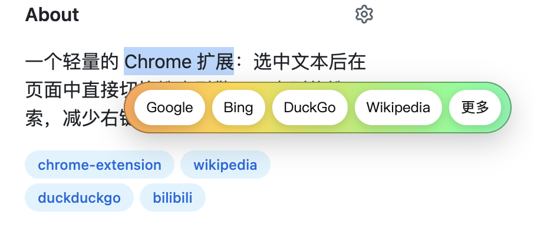

# Quick Search Switcher（自定义搜索引擎）

一个轻量的 Chrome/Edge 扩展：选中文本后在页面中直接切换搜索引擎，一步到位搜索，减少右键菜单带来的打断感。

## 功能
- 选中文本后显示浮层按钮（默认显示前 3 个，可调数量）
- 一键复制选中文本
- 浮层位置可选（上方/下方）
- 新标签位置可选（紧跟当前标签 / 窗口末尾）
- 点击“更多”下拉切换其它引擎，并可进入设置页
- 右键菜单也提供搜索引擎入口
- 引擎可自定义、排序（拖拽 / 上下移动）
- 自动保存 + 语言/主题切换
- 快速添加常用引擎

## 安装（开发者模式）
1. 打开 `chrome://extensions`
2. 开启“开发者模式”
3. 点击“加载已解压的扩展程序”
4. 选择本项目目录

也可以参考这篇安装教程：
https://www.7longwen.com/d/zen-me-zai-chrome-shang-an-zhuang-cha-jian.html

## 使用
1. 选中网页上的文字
2. 鼠标松开后浮层出现
3. 点击引擎按钮即可新标签页搜索

## 设置
- 浮层按钮数量、浮层位置可配置
- 引擎列表可添加/删除/排序
- 支持快速添加常用引擎

## 默认/快速添加引擎
Google、Bing、Wikipedia、Zhihu、Bilibili、GitHub、Taobao、JD、Twitter、YouTube、Google Scholar

## 文件结构
- `manifest.json` 扩展清单
- `background.js` 右键菜单与打开页面
- `content.js` 选中文本浮层
- `content.css` 浮层样式
- `options.html` / `options.js` / `options.css` 设置页
- `assets/` 资源图片（二维码、截图等）

## 权限说明
- `contextMenus`：提供右键菜单
- `storage`：保存引擎与设置

## 许可证
如需开源许可证可自行补充（例如 MIT）。
